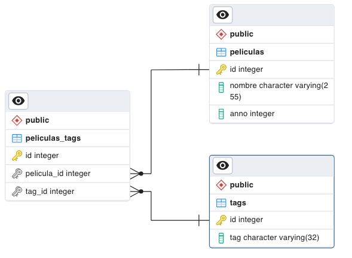

# Desafío 04 - Inegridad de datos

Este desafío pone a prueba conocimientos en la creación de modelos de bases de datos que respeten la integridad de datos y que eviten la redundancia o datos basura. Implementando soluciones para relaciones de entidades de muchos a muchos. Los requisitos del desafío quedan expresados en [este documento PDF](./04-prueba-SQL.pdf)

## Desarrollo

### Modelo DB 1



1. Revisa el tipo de relación y crea el modelo correspondiente. Respeta las claves primarias, foráneas y tipos de datos.

```sql
-- ######### PARTE 1 ######### --
DROP TABLE IF EXISTS peliculas, tags, peliculas_tags;

-- Se crea la tabla películas
CREATE TABLE peliculas (
  id SERIAL PRIMARY KEY,
  nombre VARCHAR(255),
  anno INTEGER
);

-- Se crea la tabla tags
CREATE TABLE tags (
  id SERIAL PRIMARY KEY,
  tag VARCHAR(32)
);

-- Se crea la tabla peliculas_tags que une las dos anteriores.
CREATE TABLE peliculas_tags (
  id SERIAL PRIMARY KEY,
  pelicula_id INTEGER,
  tag_id INTEGER,
  CONSTRAINT fk_pelicula_id
    FOREIGN KEY (pelicula_id)
      REFERENCES peliculas (id)
        ON DELETE CASCADE,
  CONSTRAINT fk_tag_id
    FOREIGN KEY (tag_id)
      REFERENCES tags (id)
        ON DELETE CASCADE
);
```

2. Inserta 5 películas y 5 tags; la primera película debe tener 3 tags asociados, la segunda película debe tener 2 tags asociados.

```sql
-- Se pobla de datos la DB.
INSERT INTO peliculas (nombre, anno)
VALUES
('Titanic', 1997),
('Toy Story 3', 2010),
('El Padrino', 1983),
('Vengadores Endgame', 2019),
('Coco', 2017);

INSERT INTO tags (tag)
VALUES
('SCI-FI'),
('Drama'),
('Romance'),
('Infantil'),
('General');

INSERT INTO peliculas_tags (pelicula_id, tag_id)
VALUES
(1, 2),
(1, 3),
(1, 5),
(2, 4),
(2, 5);
```

3. Cuenta la cantidad de tags que tiene cada película. Si una película no tiene tags debe mostrar 0.

```sql
-- Obtiene la cantidad de tags por película
SELECT p.id, p.nombre, COUNT(pt.tag_id) AS cantidad_tags
FROM peliculas p
LEFT JOIN peliculas_tags pt ON p.id = pt.pelicula_id
GROUP BY p.id, p.nombre
ORDER BY cantidad_tags DESC;
```

### Modelo DB 2

4. Crea las tablas correspondientes respetando los nombres, tipos, claves primarias y foráneas y tipos de datos.

```sql
-- ######### PARTE 2 ######### --
DROP TABLE IF EXISTS preguntas, usuarios, respuestas;

CREATE TABLE preguntas (
  id SERIAL PRIMARY KEY,
  pregunta VARCHAR(255),
  respuesta_correcta VARCHAR
);

CREATE TABLE usuarios (
  id SERIAL PRIMARY KEY,
  nombre VARCHAR(255),
  edad INTEGER
);

CREATE TABLE respuestas (
  id SERIAL PRIMARY KEY,
  respuesta VARCHAR(255),
  usuario_id INTEGER,
  pregunta_id INTEGER,
  CONSTRAINT fk_usuario_id
    FOREIGN KEY (usuario_id)
      REFERENCES usuarios (id),
  CONSTRAINT fk_pregunta_id
    FOREIGN KEY (pregunta_id)
      REFERENCES preguntas (id)
);
```

5. Agrega 5 usuarios y 5 preguntas.
    - La primera pregunta debe estar respondida  correctamente dos veces, por dos usuarios diferentes.
    - La segunda pregunta debe estar contestada correctamente solo por un usuario.
    - Las otras tres preguntas deben tener respuestas incorrectas.

```sql
INSERT INTO preguntas (pregunta, respuesta_correcta) VALUES
  ('¿Cuál es la capital de Francia?', 'París'),
  ('¿En qué año se fundó la ONU?', '1945'),
  ('¿Cuál es el símbolo químico del oro?', 'Au'),
  ('¿Quién escribió "Cien años de soledad"?', 'Gabriel García Márquez'),
  ('¿Cuántos lados tiene un triángulo?', '3');

INSERT INTO usuarios (nombre, edad) VALUES
  ('Juan', 25),
  ('María', 30),
  ('Carlos', 22),
  ('Laura', 28),
  ('Pedro', 35);

-- Respuestas correctas
INSERT INTO
  respuestas (respuesta, usuario_id, pregunta_id)
VALUES
  ('París', 1, 1), -- Usuario Juan responde correctamente la primera pregunta
  ('París', 2, 1), -- Usuario María responde correctamente la primera pregunta
  ('1945', 3, 2); -- Usuario Carlos responde correctamente la segunda pregunta

-- Respuestas incorrectas
INSERT INTO
  respuestas (respuesta, usuario_id, pregunta_id)
VALUES
  ('Berlín', 4, 1), 
  ('Hiroshima', 5, 2), 
  ('Ag', 1, 3), 
  ('Miguel de Cervantes', 2, 4), 
  ('4', 3, 5); 
```

6. Cuenta la cantidad de respuestas correctas totales por usuario (independiente de la pregunta).

```sql
-- Cantidad de respuestas correctas sin considerar la pregunta
SELECT u.id, u.nombre AS usuario, COUNT(r.id) AS respuestas_correctas
FROM usuarios u
LEFT JOIN respuestas r ON u.id = r.usuario_id
LEFT JOIN preguntas p ON r.pregunta_id = p.id
WHERE r.respuesta = p.respuesta_correcta
GROUP BY u.id, u.nombre;
```

7. Por cada pregunta, en la tabla preguntas, cuenta cuántos usuarios respondieron correctamente.

```sql
-- Por cada pregunta, cuantos usuarios respondieron correctamente.
SELECT p.id, p.pregunta, COUNT(DISTINCT r.usuario_id) AS usuarios_correctos
FROM preguntas p
LEFT JOIN respuestas r ON p.id = r.pregunta_id AND r.respuesta = p.respuesta_correcta
GROUP BY p.id, p.pregunta;
```

8. Implementa un borrado en cascada de las respuestas al borrar un usuario. Prueba la implementación borrando el primer usuario.

```sql
CREATE TABLE respuestas (
  id SERIAL PRIMARY KEY,
  respuesta VARCHAR(255),
  usuario_id INTEGER,
  pregunta_id INTEGER,
  CONSTRAINT fk_usuario_id
    FOREIGN KEY (usuario_id)
      REFERENCES usuarios (id)
        ON DELETE CASCADE, -- Delete on cascade
  CONSTRAINT fk_pregunta_id
    FOREIGN KEY (pregunta_id)
      REFERENCES preguntas (id)
        ON DELETE CASCADE -- Delete on cascade
);
```

9. Crea una restricción que impida insertar usuarios menores de 18 años en la base de datos.

```sql
CREATE TABLE usuarios (
  id SERIAL PRIMARY KEY,
  nombre VARCHAR(255),
  edad INTEGER CHECK(edad >= 18) -- Agrega un check
);
```

10. Altera la tabla existente de usuarios agregando el campo email. Debe tener la restricción de ser único.

```sql
-- Añade el campo email a la talba usuarios y lo restringe para que sea único.
ALTER TABLE usuarios
ADD COLUMN email VARCHAR(255) UNIQUE;
```

Y ese sería el desarrollo del desafío.